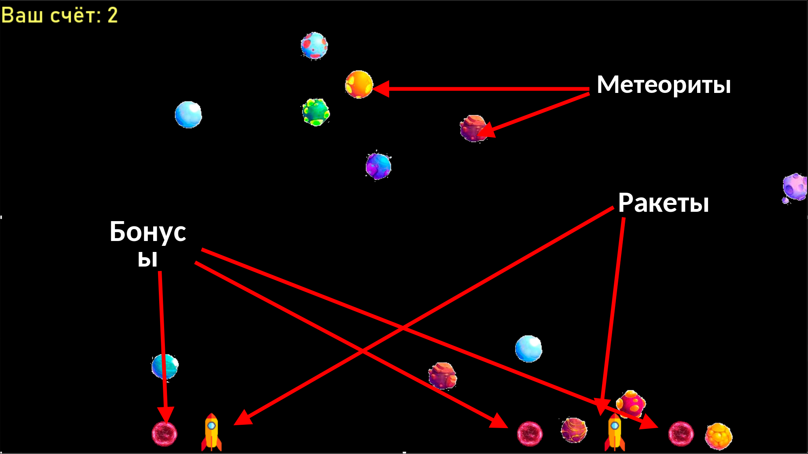

# PyGame_Meteor

## Назначение проекта

**Meteor** – аркадная игра, созданная с помощью Python и библиотеки Pygame. Игра рассчитана на игру задействуя оба полушария мозга, потому что обе руки должны управляет своим космическим кораблём. Цель – уклоняться от падающих метеоритов и собирать бонусы, соревнуясь за наивысший счёт. Проект демонстрирует возможности Pygame для реализации динамического игрового процесса с анимацией и физикой простых объектов.

## Основные возможности

- **Нестандартная идея игры:** Основная идея в том чтобы задействовать оба полушария мозга. Каждая рука управляет своим кораблём с помощью выделенных клавиш.
- **Несколько уровней сложности:** Игра предлагает 4 уровня сложности – _Easy, Middle, Hard, Unreal_. От выбранного уровня зависит скорость падения метеоритов, частота появления бонусов и общая интенсивность игрового процесса. Игроки могут подобрать уровень под свой навык.
- **Система очков и рекордов:** За уклонение от метеоров и сбор бонусов начисляются очки. Игра отслеживает лучший результат (рекорд) и сохраняет его. Таким образом, игроки стремятся побить предыдущий рекорд.

## Используемые технологии

**Python 3, PyGame, JSON**

- **Python 3.x:** Язык программирования, на котором написана игра. Обеспечивает высокую скорость разработки и простоту понимания кода.
- **Pygame:** Основная библиотека для разработки игры. Отвечает за окно приложения, обработку событий (нажатия клавиш), отрисовку спрайтов, проигрывание звуков и др.
- **Формат JSON:** Для хранения данных игры, таких как рекорды, используется JSON-файл (`data.json`). Этот файл обновляется при достижении новых рекордов, сохраняя лучший результат.

## Скриншоты и Видео




## Структура проекта

```bash
meteor-game/
├── main.py         # Главный файл игры; содержит игровой цикл, обработку событий и пр.
├── images/         # Папка с изображениями (спрайтами)
│   ├── meteor/     # Спрайты метеоритов (анимация вращения/горения)
│   └── bonus/      # Спрайты бонусов (иконки бонусных предметов)
├── data.json       # Файл с сохранёнными рекордами (формат JSON)
├── requirements.txt# Зависимости проекта (в основном Pygame)
└── README.md       # Описание проекта (текущий файл)
```

## Установка и запуск

1. **Клонирование репозитория:** Скачайте исходный код игры:
   ```bash
   git clone https://github.com/MegoM2323/PyGame_Meteor.git
   cd PyGame_Meteor
   ```
2. **Установка зависимостей:** При необходимости выполните команду установки зависимостей:
   ```bash
   pip install -r requirements.txt
   ```
3. **Запуск игры:** Запустите скрипт `main.py`:
   ```bash
   python main.py
   ```
   Откроется окно игры **Meteor**. Вы увидите два космических корабля и начнут падать метеориты.
4. **Управление в игре:**
   - Игрок 1 управляет вторым кораблём клавишами **A** (влево) и **D** (вправо).
   - Игрок 2 управляет кораблём с помощью клавиш **J** (движение влево) и **L** (движение вправо).
     Цель – уворачиваться от метеоров. Попадание метеорита по кораблю заканчивает игру. Постарайтесь продержаться как можно дольше и набрать максимум очков.
5. **Выбор сложности:** При запуске можно выбрать уровень сложности (если предусмотрено меню или настройка). На более высоких сложностях скорость и плотность метеоров увеличиваются.
6. **Рекорды:** После окончания игры текущий счёт сравнивается с сохранённым рекордом. Если вы побили предыдущий рекорд, он сохранится в `data.json`. В следующей сессии игры этот рекорд будет отображаться как целевая величина для побития.

## Лицензия

Лицензия не указана. (По умолчанию, все права на исходный код принадлежат автору проекта.)
